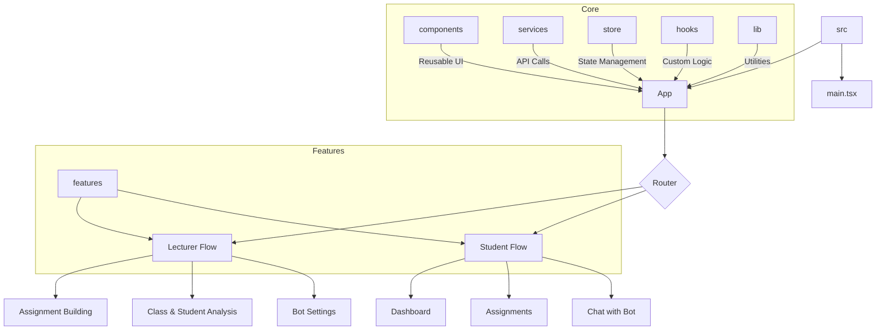

# StudyFlow

StudyFlow is a comprehensive platform designed to streamline the educational process for both lecturers and students. It provides tools for assignment management, class analysis, and personalized learning, all powered by an intelligent bot.

## Key Features

- **For Lecturers:**
  - **Assignment Building:** Easily create and manage assignments.
  - **Class Analysis:** Gain insights into class performance and student engagement.
  - **Student Analysis:** Track individual student progress and identify areas for improvement.
  - **Bot Settings:** Customize the behavior of the educational bot.

- **For Students:**
  - **Interactive Learning:** Engage with course material through an intelligent bot.
  - **Personalized Feedback:** Receive instant feedback on assignments and quizzes.
  - **Progress Tracking:** Monitor learning progress and achievements.

## Tech Stack

- **Frontend:** React, TypeScript, Vite
- **Styling:** Tailwind CSS
- **State Management:** Redux Toolkit
- **Routing:** React Router
- **UI Components:** Shadcn UI, FullCalendar
- **Linting:** ESLint

## Conventions

- **Package manager:** PNPM only
- **Commands:**
  - Install: `pnpm install`
  - Dev (frontend): `pnpm dev`
  - Backend build: `pnpm -C server build`
  - Backend tests: `pnpm backend:test`
- **Do not use** `npm` or `yarn` in this repo (avoid creating `package-lock.json` / `yarn.lock`).

## Project Structure



## Getting Started

1.  **Clone the repository:**
    ```bash
    git clone https://github.com/your-username/studyflow.git
    ```
2.  **Install dependencies:**
    ```bash
    cd studyflow
    pnpm install
    ```
3.  **Run the development server:**
    ```bash
    pnpm dev
    ```

## Log file location

השרת כותב לוגים בפורמט JSON הן למסך והן לקובץ.

- מיקום קובץ הלוגים: `logs/app.log` (בתיקיית השורש של הריפו).

בדיקות מהירות (CMD):

```cmd
if exist logs\app.log (echo קיים) else (echo לא קיים)
type logs\app.log
```

